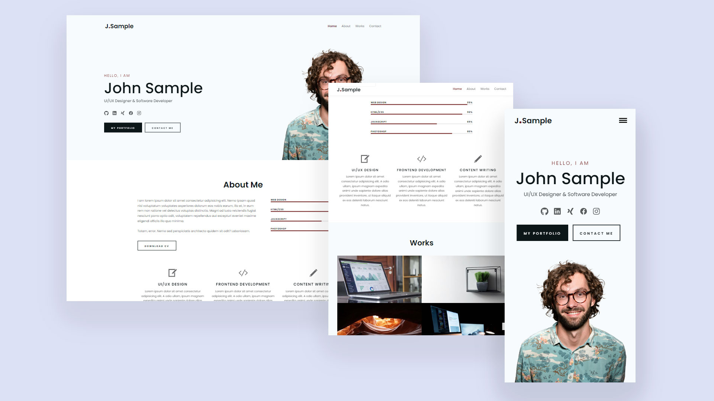

# Doğa Destici — Kişisel Web Sitesi



Doğa Destici'nin kişisel tanıtım ve akademik paylaşım sitesi. Tamamen statik HTML, CSS ve JavaScript ile geliştirilmiş, GitHub Pages üzerinde yayınlanan, iki dilli (TR/EN) bir portfolyo ve blog sitesidir.

## İçerik

- [Özellikler](#özellikler)
- [Sayfa Yapısı](#sayfa-yapısı)
- [Teknolojiler](#teknolojiler)
- [Yerel Geliştirme](#yerel-geliştirme)
- [Yayınlama](#yayınlama)
- [Katkı](#katkı)

## Özellikler

- **İki dilli yapı (TR/EN):** `en/` klasöründeki İngilizce sayfalar, üst menüden 🇬🇧 EN ile geçiş yapılabilir.
- **Dark mode:** `js/site.js` ile tüm sayfalarda çalışan açık/koyu tema geçişi; tercih `localStorage`'da saklanır.
- **Duyarlı tasarım (responsive):** `css/media.css` ile mobil ve tablet uyumlu.
- **AOS animasyonları:** Scroll üzerine giriş animasyonları (AOS kütüphanesi).
- **Akademik araçlar:** `academic-tools.html` sayfasında kod blokları, tek tıkla kopyalama butonları ve arXiv aboneliği/filtreleme rehberleri.
- **Yükleme performansı:** Tüm görseller boyutlandırılmış ve sıkıştırılmış; içerik görselleri `loading="lazy"` ile yüklenir.

## Sayfa Yapısı

| Sayfa | Açıklama |
| --- | --- |
| `index.html` | Anasayfa |
| `akademik.html` | Akademik bölümü girişi |
| `academic-info.html` | Akademik bilgiler ve CV |
| `academic-projects.html` | Akademik projeler |
| `academic-tools.html` | Araştırma araçları ve kaynaklar |
| `sosyal.html` | Sosyal faaliyetler |
| `gezi.html`, `gezi-rotalar.html`, `gezi-erasmus.html` | Gezi ve Erasmus bölümleri |
| `blog.html`, `blog-akademik.html`, `blog-sosyal.html` | Blog sayfaları |
| `en/` | Tüm sayfaların İngilizce sürümleri |

## Teknolojiler

- Saf HTML5, CSS3, JavaScript (harici framework yok)
- [AOS](https://github.com/michalsnik/aos) — scroll animasyonları (CDN)
- GitHub Pages — statik yayınlama

## Yerel Geliştirme

Sunucu gerektirmez; dosyaları doğrudan tarayıcıda açabilirsiniz. İsterseniz basit bir yerel sunucu ile çalıştırın:

```bash
python3 -m http.server 8000
```

Ardından `http://localhost:8000` adresini ziyaret edin.

## Yayınlama

Site, `main` dalındaki dosyalardan GitHub Pages ile otomatik yayınlanır:

1. Değişiklikleri `main` dalına push edin.
2. Repo **Settings → Pages** bölümünde kaynak olarak `main` dalının seçili olduğundan emin olun.
3. Site `https://dogadestici.github.io/` adresinde yayına alınır.

## Katkı

- JS mantığı `js/site.js` (dark mode, mobil menü) ve `js/main.js` (sticky header, scroll aktifi) dosyalarında toplanmıştır.
- Stil değişiklikleri için `css/main.css`, `css/media.css` ve `css/reset.css`.
- Görsel eklerken optimize edilmiş (maks. 1600px, JPEG kalite ~80) ve `loading="lazy"` içeren `` etiketi kullanın.
- Yeni sayfa eklerken hem TR hem `en/` sürümünü oluşturun.
